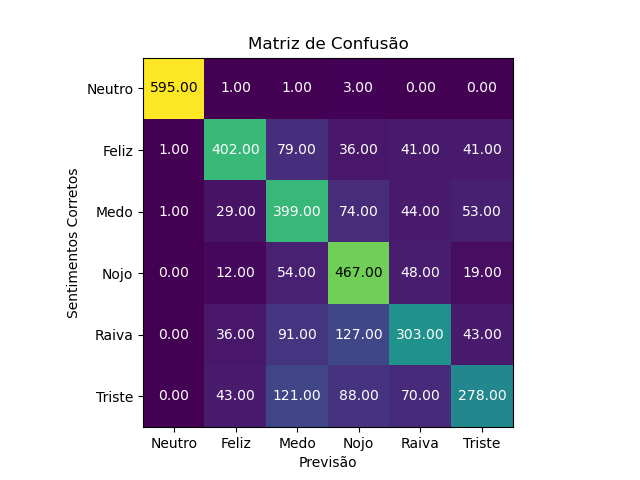

# Análise de Sentimentos sobre a pandemia de COVID-19 a partir do Twitter
Este repositório tem como finalidade:
* Criar um dataset para treinamento de modelos de aprendizado de máquina sobre as 5 emoções de Ekman.
* Analisar os sentimentos predominantes durante os primeiros 12 meses da pandemia de COVID-19.

## Sobre o dataset de treinamento
O dataset é composto por tweets que contenham 
hashtags relacionadas às 5 emoções de Ekman, capturados em
todo o ano de 2018 e, particularmente para as emoções de 
raiva e nojo, forma feitas capturas exclusivamente sobre essas hashtags
durante todo o ano de 2016 e, ainda devido à insuficiência de amostras,
mais tweets com a hashtag #raiva foram coletados durante todo o ano de 2017.

Os tweets rotulados como neutros foram copiados do Tweets_Mg dataset do
blog minerando dados.

O dataset tweets_ekman.csv, usado para treinamento, possui o segunte formato:

## Sobre o dataset alvo
O dataset tweets_pandemia é composto por tweets capturados entre abril de 2020 e
março de 2021. Os tweets foram selecionados de acordo com a presença das palavras-chave
"isolamento", "quarentena", "covid", "corona", "coronavirus", "corona virus", "covid-19",
"covid19" e/ou "covid 19".

## Sobre o teste do modelo
O modelo de classificação foi feito a partir da implementação do classificador
linear LinearSVC, disponível através do scikit-learn. Esse modelo foi treinado
a partir do dataset tweets_ekman e seu desempenho foi medido através de uma
matriz de erro (ou matriz de confusão), a partir da qual obtivemos os seguintes
valores:

As demais medidas de precisão, recall e f-score:

## Resultado
A partir o modelo treinado, classificamos os tweets do dataset alvo nas 5 emoções de Ekamn +
o sentimento Neutro. A neutralidade foi considerada para filtrar tweets que poderiam ser
informativos, como postagens de jornais. Como esperado, podemos notar uma grande predominância
de sentimentos negativos, principalmente raiva, medo e tristeza.

É possível ver ainda a variaçã de emoções ao longo dos primeiros 12 meses de pandemia. Pode-se notar
uma predominância de sentimentos negativos como medo, tristeza e raiva.

## Referências
Karami, Amir, et al. "Twitter and research: a systematic
literature review through text mining." IEEE Access 8 (2020):
67698-67717.

P. Ekman, “An argument for basic emotions,” Cognition Emotion,
vol. 6, no. 3, pp. 169–200, 1992.

Colnerič, Niko, and Janez Demšar. "Emotion recognition on 
twitter: Comparative study and training a unison model." IEEE 
transactions on affective computing 11.3 (2018): 433-446.

Towards Data Science. *How to Deal with Imbalanced Data*. URL:
https://towardsdatascience.com/how-to-deal-with-imbalanced-data-34ab7db9b100.
(Acessado em abril de 2021).

KDNuggets. *7 Techniques to Handle Imbalanced Data*. URL:
https://www.kdnuggets.com/2017/06/7-techniques-handle-imbalanced-data.html.
(Acessado em abril de 2021).

ML+. *How to Train Text Classification in SpaCy*. URL: 
https://www.machinelearningplus.com/nlp/custom-text-classification-spacy/.
(Acessado em abril de 2021).

Advanced NLP with SpaCy.  *Chapter 4: Training a neural network model*. URL: 
https://course.spacy.io/en/chapter4. (Acessado em abril de 2021)